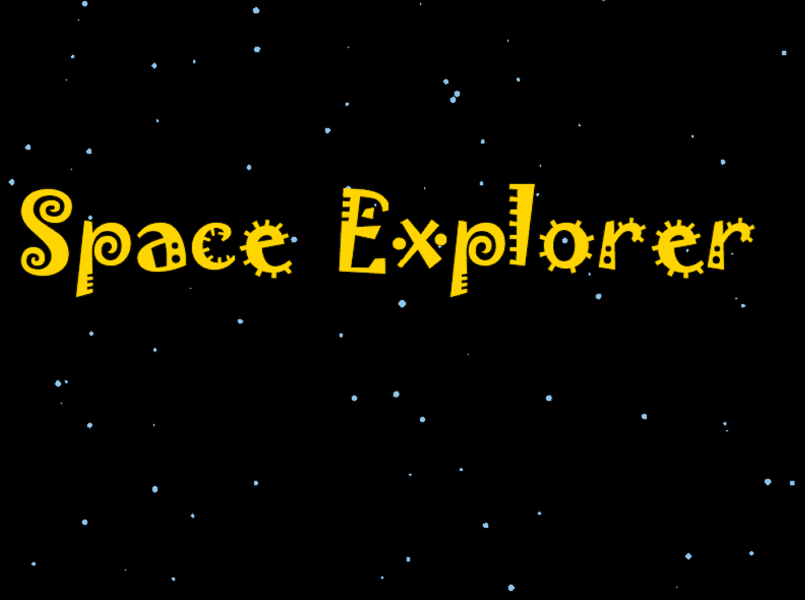
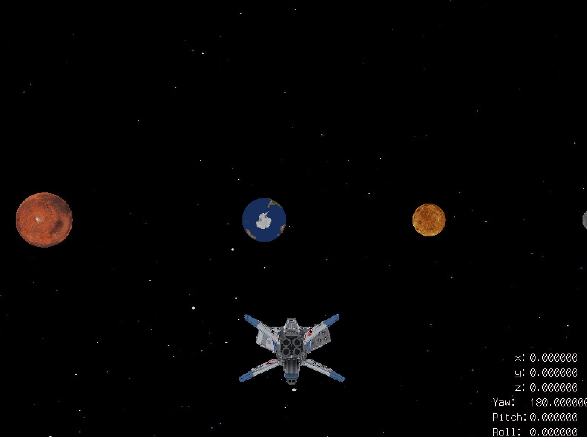

# SolarExplorer
A spacecraft flight game that allow you to explore solar system. This is the final project for 24780 Engineering Computation at CMU

## Control Command
Arrows key: control roll/pitch angles  
M: show menu  
Space: shoot bullet  
W/S: move forward/backward  
A/D: move left/right  
Shift: accelerate  
P: perspective switch  
R: reset view  
G: Generate monster  

{:height="500px" width="500px"}
{:height="500px" width="500px"}
